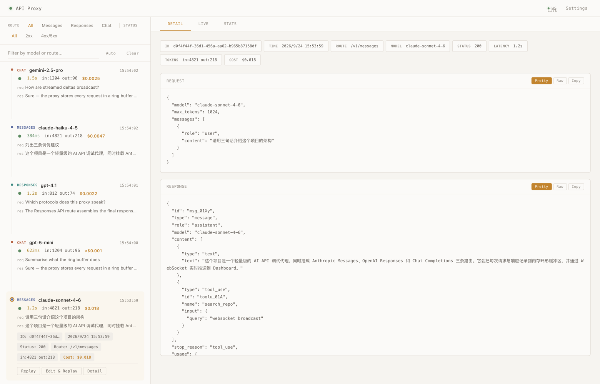
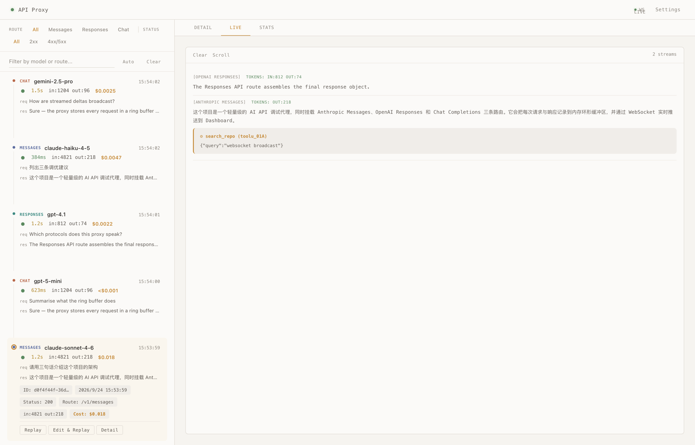
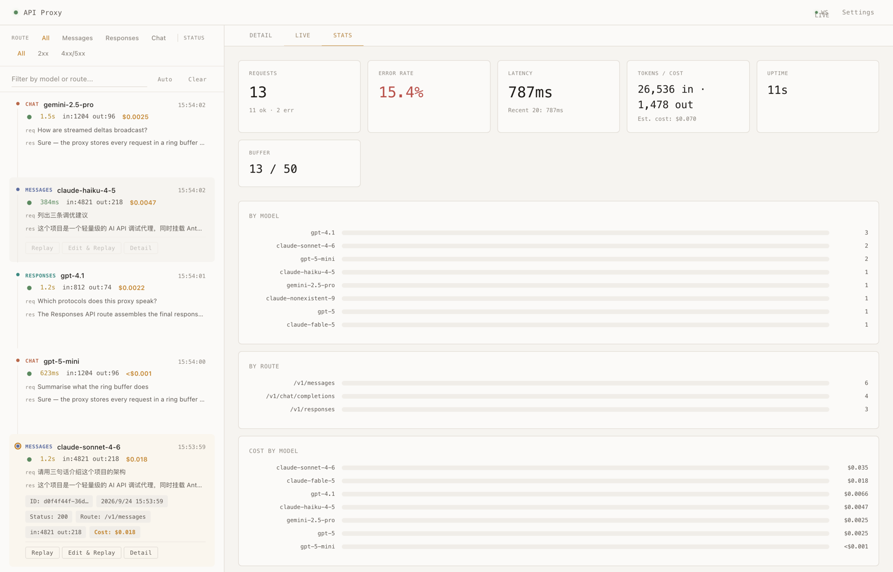
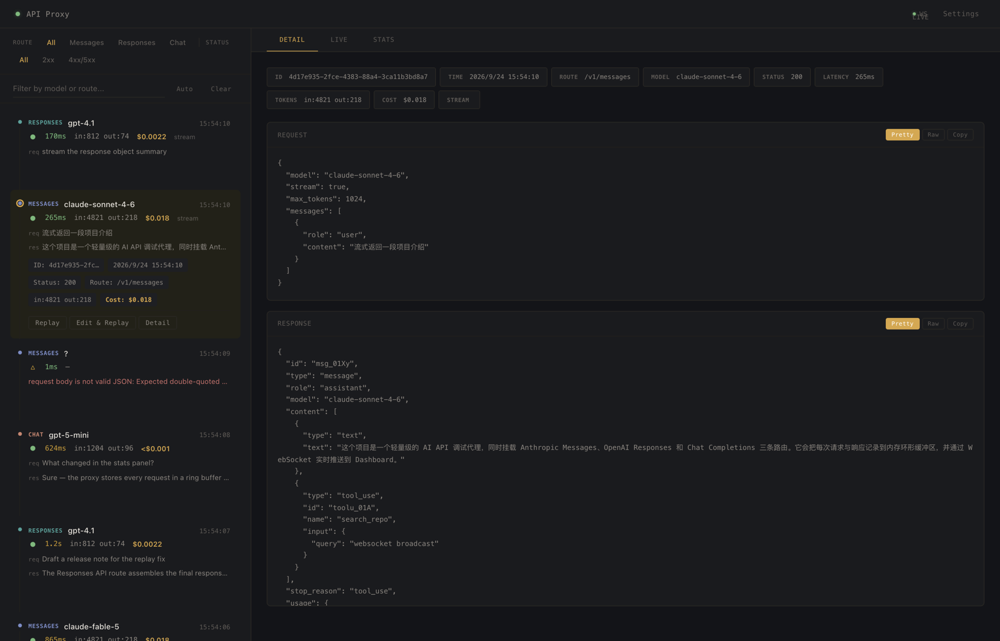

# ai-api-proxy

一个面向 AI 接口调试、观测和协议适配的轻量代理服务，内置 Web Dashboard。

**统一入口** `server.js` 同时启动 3 条 AI API 路由 + Web 管理界面 + WebSocket 实时推送：

- `POST /v1/messages` ← Anthropic Messages API
- `POST /v1/responses` ← OpenAI Responses API
- `POST /v1/chat/completions` ← OpenAI Chat Completions API

它的目标不是成为重型 API 网关，而是作为一个足够简单、易读、易改的代理层：

- 统一转发请求到指定上游 AI 服务
- 通过 Dashboard 实时查看请求历史、响应内容、流式输出
- 内置 Replay 重放和请求编辑器，在 UI 中快速迭代调试
- 自动估算每次请求的费用（支持 30+ 模型定价）
- 在 UI 中直接管理所有配置项，无需手动编辑 JSON 文件
- 保留完整请求与响应日志，便于排查问题
- 在不破坏流式体验的前提下解析 SSE 事件
- 作为后续做鉴权、限流、脱敏、协议转换的基础骨架

## 特性

- 极简实现：`server.js` 启动入口 + `lib/` 下 7 个职责单一的小模块
- **Web Dashboard**：Timeline 风格请求卡片、实时流查看、统计面板、在线配置
- **Replay 重放**：一键重发历史请求，内嵌 JSON 编辑器支持快速修改，并复用原始请求头
- **费用估算**：服务端匹配模型定价（Claude / GPT / Gemini），按请求和按模型统计
- **失败可见**：上游报错、body 解析失败、超过体积限制，都会作为一条记录出现在列表里
- **路由筛选**：按 API 路由和 HTTP 状态码快速过滤请求列表
- **WebSocket 实时推送**：流式响应在浏览器中实时展现，请求结果即时推送
- 支持 Anthropic `messages`、OpenAI `responses`、`chat/completions` 协议
- 支持非流式响应与 SSE 流式响应
- 记录请求体、响应体、异常信息，以及脱敏后的上游请求头
- 尽量透明转发请求头和响应头
- 客户端断连时自动中止上游请求，避免资源浪费

## 界面预览

### 请求列表与请求详情

左侧 Timeline 卡片直接显示路由、模型、延迟、token 与估算费用，以及请求/响应预览；右侧展示完整 Request / Response Body。展开的卡片上可以直接 Replay 或 Edit & Replay。



### 实时流（Live）

流式响应的 delta 通过 WebSocket 实时推送到浏览器，按请求分组累积成连续文本，工具调用单独成块，流结束后在分组标题上显示 token 用量。



### 统计面板（Stats）

请求总数、错误率、延迟、token 与费用，以及按模型 / 按路由 / 按模型费用的分布。费用由服务端在请求完成时计算一次，与 token 统计同一口径。



### 深色模式

跟随系统 `prefers-color-scheme` 自动切换。



## 适用场景

- 本地调试 AI SDK / CLI / 前端调用
- 通过 Dashboard 直观观察请求/响应/流式输出
- 在 UI 中反复修改参数并 Replay，提高 debug 效率
- 复盘工具调用参数、文本输出、异常响应
- 观察各模型的 token 消耗和费用
- 作为企业内部网关或更复杂代理的原型项目

## 项目结构

```text
.
├── server.js              # 启动入口（读取配置 → 创建应用 → 监听端口）
├── lib/
│   ├── app.js             # 应用工厂：Dashboard + WebSocket + 管理 API + 代理路由挂载
│   ├── config.js          # 统一配置加载/保存，兼容旧字段
│   ├── proxy.js           # 共享的上游请求实现 + 代理中间件工厂
│   ├── store.js           # 环形缓冲区请求存储 + O(1) ID 索引 + 实时统计
│   ├── sse.js             # SSE 解析、流组装、实时 chunk 解析、token 提取
│   ├── preview.js         # 列表卡片使用的请求/响应预览文本
│   └── pricing.js         # 模型定价表与费用估算
├── public/
│   └── dashboard.html     # 自包含 Web Dashboard，零构建
├── docs/screenshots/      # README 截图
├── server-anthropic.js    # [保留] 旧版 Anthropic 入口
├── server-openai.js       # [保留] 旧版 OpenAI 入口
├── server-raw.js          # [保留] 旧版 Raw 入口
├── config.json            # 统一配置文件
├── package.json
├── LICENSE
└── README.md
```

## 快速开始

### 1. 安装依赖

```bash
npm install
```

### 2. 配置

从示例创建 `config.json`，再填入上游服务地址和可选鉴权信息：

```bash
cp config.json.example config.json
```

```json
{
  "host": "127.0.0.1",
  "port": 3000,
  "apiBase": "https://your-ai-api-upstream",
  "apiKey": "sk-xxxx",
  "proxyAccessToken": "",
  "allowRemoteAccess": false,
  "organization": "org_xxx",
  "project": "proj_xxx",
  "logFile": "proxy.log",
  "maxLogFileBytes": 52428800,
  "timeoutMs": 300000,
  "bodyLimit": "10mb",
  "ringBufferSize": 500,
  "maxCaptureBytes": 1048576,
  "enableFileLogging": true
}
```

兼容旧版配置中的 `upstream` 字段（自动映射为 `apiBase`）。

### 3. 启动

```bash
npm start
```

启动后输出：

```text
╔══════════════════════════════════════════════════════╗
║           AI API Proxy — Dashboard Ready             ║
╠══════════════════════════════════════════════════════╣
║  Dashboard : http://localhost:3000                   ║
║  Upstream  : https://your-ai-api-upstream            ║
╠══════════════════════════════════════════════════════╣
║  POST /v1/messages                                   ║
║  POST /v1/responses                                  ║
║  POST /v1/chat/completions                           ║
╚══════════════════════════════════════════════════════╝
```

### 4. 打开 Dashboard

浏览器访问 `http://localhost:3000/`：

| 面板 | 功能 |
|------|------|
| **请求列表** (左侧) | Timeline 风格卡片，路由色标区分，请求/响应内容预览，费用显示 |
| **请求详情** (右侧 Detail Tab) | 完整 Request / Response Body，Pretty / Raw 切换，一键复制 |
| **实时流** (右侧 Live Tab) | WebSocket 实时推送流式输出，文字 / 工具调用分组显示 |
| **统计** (右侧 Stats Tab) | Token 用量、延迟分布、费用统计、按模型/路由柱状图 |
| **设置** (Settings 按钮) | 在线修改全部配置项，保存后即时生效 |

### 5. Dashboard 操作

| 操作 | 方式 |
|------|------|
| **查看请求详情** | 双击卡片 → 右侧打开完整 Request / Response Body |
| **展开卡片概要** | 单击卡片 → 内嵌展开 ID、时间戳、状态码等 meta 信息 |
| **Replay 重放** | 卡片 hover → Replay（直接重发）或 Edit & Replay（修改 JSON 后重发） |
| **筛选** | 顶部 Route / Status chip 按钮 + 搜索框 |
| **查看费用** | 卡片上直接显示单次费用，Stats Tab 显示总计和按模型分布 |

旧的独立入口仍然可用：

```bash
npm run start:anthropic   # 仅 Anthropic 路由
npm run start:openai      # 仅 OpenAI 路由
npm run start:raw         # 全部路由（原始日志）
```

## 调用示例

所有路由统一在同一个端口，以下使用默认 3000 端口：

### Anthropic Messages

```bash
curl http://localhost:3000/v1/messages \
  -H "content-type: application/json" \
  -H "x-api-key: YOUR_KEY" \
  -d '{
    "model": "claude-sonnet-4-6",
    "messages": [
      {
        "role": "user",
        "content": "你好，介绍一下你自己"
      }
    ],
    "stream": false
  }'
```

### OpenAI Responses

```bash
curl http://localhost:3000/v1/responses \
  -H "content-type: application/json" \
  -H "authorization: Bearer sk-xxxx" \
  -d '{
    "model": "gpt-5",
    "input": "你好，介绍一下你自己",
    "stream": false
  }'
```

### OpenAI Chat Completions

```bash
curl http://localhost:3000/v1/chat/completions \
  -H "content-type: application/json" \
  -H "authorization: Bearer sk-xxxx" \
  -d '{
    "model": "gpt-5-mini",
    "messages": [{"role": "user", "content": "你好"}],
    "stream": false
  }'
```

## 内部 API

Dashboard 使用的内部 API，也可直接调用：

这些管理接口和 WebSocket 只接受来自本机的连接。即使代理路由显式开放到局域网，Dashboard 也不会随之开放。

| Method | Path | Purpose |
|--------|------|---------|
| `GET` | `/__api/config` | 读取配置（apiKey 已脱敏） |
| `PUT` | `/__api/config` | 部分更新配置，自动保存到文件 |
| `GET` | `/__api/requests` | 请求历史列表 (`?limit=N`，O(limit) 高效查询)，含预览文本与估算费用 |
| `GET` | `/__api/requests/:id` | 单个请求完整详情（含实际转发到上游的请求头，敏感值已脱敏），大 body 自动截断 |
| `DELETE` | `/__api/requests` | 清除所有请求记录 |
| `GET` | `/__api/stats` | 实时统计信息，含累计 token 与费用 |
| `POST` | `/__api/replay` | 重放请求：`{ requestId }` 重放原始请求，或 `{ requestId, requestBody }` 用改过的 body 重放 |

重放会复用原始请求转发到上游时的请求头（例如 `anthropic-version`、`anthropic-beta`），只把其中的凭据换成当前配置里的 apiKey，因此改过 body 的 Edit & Replay 同样能带上正确的协议头。

## WebSocket 协议

Dashboard 通过 WebSocket 接收实时推送，消息格式：`{ type, data }`

| type | 触发时机 | data |
|------|---------|------|
| `request-detail` | 请求完成（成功、失败，或被代理拒绝） | 完整请求记录（含 request / response body） |
| `stream-chunk` | 流式响应每个上游读取块 | `{ id, route, label, chunks: [{ type, content }] }` |
| `config-updated` | 配置保存到磁盘后 | `{ config }` |
| `requests-cleared` | 请求记录被清除 | `{}` |

`stream-chunk` 按上游读取块批量推送：一次网络读取中解析出的所有 delta 合成一帧，避免长流把 WebSocket 打成一帧一个 token。

## 配置说明

所有字段集中在一个统一的 `config.json` 中：

| 字段 | 类型 | 默认值 | 说明 |
|------|------|--------|------|
| `host` | string | `127.0.0.1` | 监听地址；修改后需重启 |
| `port` | number | `3000` | 本地监听端口 |
| `apiBase` | string | `https://api.openai.com` | 上游服务根地址（兼容旧字段 `upstream`） |
| `apiKey` | string | `""` | 上游 API Key；管理 API 永不返回其内容 |
| `proxyAccessToken` | string | `""` | 代理访问令牌，调用方通过 `x-proxy-token` 发送 |
| `allowRemoteAccess` | boolean | `false` | 是否允许监听非本机地址；同时必须配置访问令牌 |
| `organization` | string | `""` | 可选 OpenAI Organization 头 |
| `project` | string | `""` | 可选 OpenAI Project 头 |
| `logFile` | string | `proxy.log` | 日志文件路径 |
| `maxLogFileBytes` | number | `52428800` | 单个日志文件上限，超限轮转为 `.1` |
| `timeoutMs` | number | `300000` | 上游请求超时时间（毫秒） |
| `bodyLimit` | string | `10mb` | JSON Body 大小限制 |
| `ringBufferSize` | number | `500` | 内存保留的请求记录数，超限时淘汰最早的 |
| `maxCaptureBytes` | number | `1048576` | 每个请求或响应在 Dashboard/日志中的最大捕获字节数 |
| `enableFileLogging` | boolean | `true` | 是否启用文件日志 |

> `host`、`port` 和 `bodyLimit` 修改后需要重启服务；其他配置保存后即时生效。修改 `ringBufferSize` 会自动调整缓冲区容量。

### 局域网访问

默认只监听 `127.0.0.1`。确实需要让其他机器调用代理时，必须显式配置：

```json
{
  "host": "0.0.0.0",
  "allowRemoteAccess": true,
  "proxyAccessToken": "use-a-long-random-token"
}
```

远程调用时增加 `x-proxy-token: use-a-long-random-token` 请求头。该请求头不会转发给上游，Dashboard 和 `/__api/*` 仍只允许本机访问。

## 关键原理

### 1. 透明转发优先

尽量把调用方请求直接转发给上游，只在代理层修正必须修正的信息：

- `Host` — 改写为上游主机名
- `Content-Length` — 移除，由 Node 自动计算
- OpenAI 代理中注入可选鉴权头（`Authorization`、`OpenAI-Organization`、`OpenAI-Project`）

这样做的好处：调用方接入成本低，代理层不容易引入额外字段映射错误，更适合作为调试代理和基础设施原型。

### 2. SSE 三路并行处理

流式响应不能等全部接收完再返回给客户端。当前实现同时做到三件事：

1. 从上游按块读取 SSE 数据，每读到一个 chunk 立即 `res.write()` 给客户端
2. 同步解析 chunk 中的 SSE 事件，按上游读取块批量推送给 Dashboard 实时流面板
3. 在 `maxCaptureBytes` 范围内组装结构化 JSON，存入内存环形缓冲区并写入日志文件

代理不会因为 Dashboard 连接断开而影响客户端的流式体验，也不会因为大量 Dashboard 连接而导致上游流量放大。流向客户端的方向带有背压：`res.write()` 返回 false 时会等 `drain`，客户端断连则立刻以错误结束等待。

### 3. 客户端断连传播

如果调用方在流式响应过程中断开连接（关闭页面、取消请求），代理会监听响应连接的 `close` 事件并立即 abort 上游 `fetch`。这避免了代理层继续下载无人接收的数据。

### 4. 环形缓冲区 + O(1) ID 索引

请求记录存于内存环形缓冲区（默认 500 条），超限时从头部淘汰。ID 查找通过 `Map` 实现 O(1)。请求开始时登记总量，完成时一次性累计成功/失败、token 和延迟；在途请求单独计入 `pendingRequests`。

### 5. SSE 事件解析

无论是 Anthropic 还是 OpenAI，原始 SSE 事件通常很零碎：

- 文本输出按 delta 分段发送
- 工具调用参数按增量 JSON 发送
- 状态信息和 token usage 分布在多个事件里

代理在流结束后将碎片事件组装为结构化 JSON（如 Anthropic Message 对象或 OpenAI Response 对象），便于日志查看和 Dashboard 展示。

### 6. 请求费用估算

服务端内置 20+ 模型定价表（`lib/pricing.js`），按最长匹配识别模型名，因此带日期后缀（`claude-sonnet-4-6-20250219`）或网关前缀（`anthropic/claude-sonnet-4-6`）的模型名都能匹配到同一份定价。每条记录在完成时计算一次 `costUsd`，统计接口汇总出 `totalCostUsd` 和按模型的 `costByModel`。

费用只有服务端一份口径：卡片、详情面板、统计面板显示的是同一个值，和 token 统计覆盖同一时间窗口，不会随前端重渲染或缓存漂移。定价是估算值，不等于实际账单。

### 7. 被拒绝的请求同样可见

请求体不是合法 JSON，或超过 `bodyLimit` 时，Express 不会进入任何路由处理函数。如果不处理，这类失败既不会出现在 Dashboard 里，客户端还会收到一页带本机绝对路径的 HTML 堆栈——对一个调试代理来说，这恰恰是最该被看见的失败。

代理注册了统一错误中间件：按路由的协议形状返回 JSON 错误（Anthropic 用 `{ type: 'error', error: { ... } }`，OpenAI 用 `{ error: { ... } }`），同时写入一条失败记录并广播给 Dashboard，因此它和其他请求一样出现在列表里。

### 8. 请求头被记录并可复用

转发到上游的请求头会脱敏后记录在请求记录里（名字里含 `authorization`、`api-key`、`token`、`secret`、`cookie` 的头一律替换为 `[redacted]`），详情接口可以直接核对代理究竟发了什么。Replay 复用这份记录，把脱敏占位符丢弃后用当前配置的 apiKey 补齐，所以 `anthropic-version` 之类的协议头不会在重放时丢失。

## 运行要求

- Node.js 18+

原因：使用了 Node 内置 `fetch`，`express@5` 需要较新 Node 版本。

## 日志

日志默认记录请求体、响应体、流式组装结果和异常信息。日志通过异步队列顺序写入，超过 `maxLogFileBytes` 时轮转为 `.1`，单次记录受 `maxCaptureBytes` 限制。

请注意：日志仍可能包含提示词、工具参数等敏感业务数据，不需要时应关闭文件日志。

## 已知限制

- 当前仍是 "轻量代理"，不是生产级 API 网关
- 没有限流、熔断、重试等生产网关能力
- 只代理上面列出的三条 POST 路由；`GET /v1/models` 之类的其它路径不会被转发，直接返回 404 且不产生记录
- Live 面板的 token 用量依赖流式事件里的 usage：`chat/completions` 的流式解析目前只取 delta，不解析最后一个 chunk 的 usage，因此该路由在 Live 面板不显示 token 用量（请求完成后的组装结果里仍然有 usage，卡片和统计面板正常）
- 流式日志解析针对主流事件格式，不保证覆盖所有未来事件类型
- 请求历史仅保存在内存中，进程重启后会清空
- Dashboard 没有独立登录页，因此管理界面强制仅限本机
- 旧版独立入口主要用于兼容，安全边界和功能不如统一入口完整

## Roadmap

- 增加环境变量配置支持
- 增加请求 ID 与结构化日志
- 增加可配置的字段级业务数据脱敏
- 增加协议适配层，例如 `messages → responses`
- 增加 CI 和浏览器端端到端测试
- Dashboard 支持多上游管理及按模型路由

## 测试

```bash
npm run check
npm test
```

测试覆盖配置校验与密钥隐藏、请求统计生命周期与费用聚合、定价匹配与预览文本提取、代理头部与查询参数转发、流式捕获上限与超时，以及起真实 HTTP 服务的端到端用例：三条代理路由、管理 API、Replay 头部复用、被拒绝请求的入库，和 WebSocket 推送。

## 贡献

欢迎提交 Issue 和 PR。

如果你准备基于这个项目做扩展，比较适合从下面几个方向入手：

- 增加中间件化能力
- 增加更多上游协议支持
- 增加更完整的观测与错误处理

## License

MIT

## 说明

这个项目当前更偏向 "工程骨架" 和 "可读实现"，而不是一个已经产品化的通用网关。

如果你需要一个简单、清晰、方便二次开发的 AI API 代理起点，这个仓库就是为这个目的准备的。
